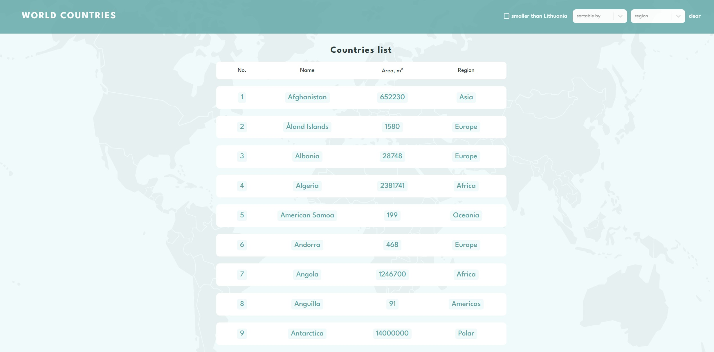

# World countries website

## Table of contents

- [Overview](#overview)
  - [Screenshot](#screenshot)
  - [Links](#links)
- [My process](#my-process)
  - [Built with](#built-with)

## Overview

Website features:

- list is sortable alphabetically by name (ascending, descending)
- list is filterable by region
- list is filterable by area, it filter smaller countries than Lithuania

### Screenshot

### Links

- Live Site URL: [here](https://graceful-cascaron-9894fc.netlify.app/)

## My process

### Built with

- Semantic HTML5 markup
- SASS
- Flexbox
- Grid
- [React](https://reactjs.org/) - JS library
